# Hi, I'm Simon 👋
 
CS student who learns by building things and breaking them first.
 
## About me
 
- 🎓 Studying Computer Science at NTNU
- 🌱 Currently learning **Low level programming**
- 🔭 Working on **a text editor written in C**
<!-- - 📫 Reach me at **[email]** or on [LinkedIn](https://linkedin.com/in/YOUR_LINKEDIN) -->

## Featured projects
 
<a href="https://github.com/SimWsol/rune">
  <picture>
    <source media="(prefers-color-scheme: dark)" srcset="profile/pin-rune-dark.svg" />
    
  </picture>
</a>

## GitHub stats
 
<picture>
  <source media="(prefers-color-scheme: dark)" srcset="profile/stats-dark.svg" />
  
</picture>
<picture>
  <source media="(prefers-color-scheme: dark)" srcset="profile/top-langs-dark.svg" />
  
</picture>
<picture>
  <source media="(prefers-color-scheme: dark)" srcset="https://streak-stats.demolab.com?user=SimWsol&hide_border=true&theme=github-dark-blue" />
  
</picture>

---

<picture>
  <source media="(prefers-color-scheme: dark)" srcset="https://raw.githubusercontent.com/SimWsol/SimWsol/output/github-contribution-grid-snake-dark.svg" />
  <source media="(prefers-color-scheme: light)" srcset="https://raw.githubusercontent.com/SimWsol/SimWsol/output/github-contribution-grid-snake.svg" />
  
</picture>
